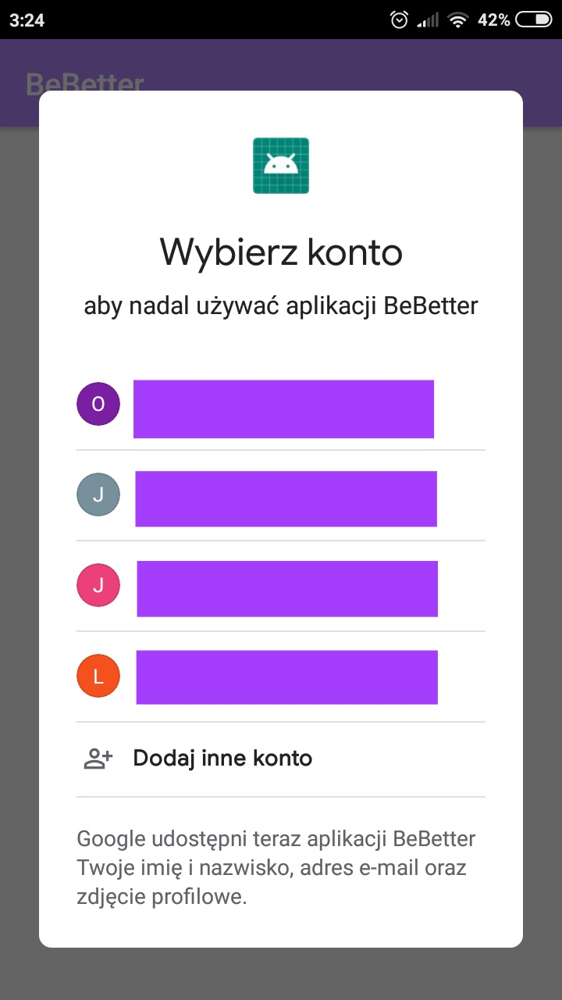

# BeBetter-client

BeBetter is a mobile habit tracker application with social elements and reward system.

Users can create challenges (habits) and track progress in completing that challenges. Many users can join one challenge and have a conversation in the form of comments. For completing goals users are rewarded with ranking points and achievements, which are visible on user’s profile page.

Project is still under development - additional funcionalities will be added and refactoring will be done.

## Architecture

Project was created in client-server architecture. 

The main purpose of the server application ([BeBetter-server](https://github.com/ozarychta/BeBetter-server)) is to implement application logic, save and read data from a global database and to share it with mobile application with REST API.

BeBetter-client is an Android mobile application that consumes the API and serves as a graphical user interface for the application.

## Main functionalities

#### Signing in with Google account
 

#### Searching for challenges (habits) to join
  

#### Or creating new challenges
 

#### My challenges view showing challenges that user is taking part in

#### Tracking progress in challenges (and receiving points for it)
 

#### Setting reminders

#### Simple statistics
 

#### Commenting challenges

#### User profile
 

#### Friends list (also serving as a ranking)

## Technologies and tools
* Android
* Java
* Google Sign-In
* Volley
* MPAndroidChart
* Room Persistence Library, SQLite
* Android Studio

## Functionalities to add in future
* Add more statistics (comparing user with other challenge participants, maybe ranking for each challenge)
* Showing list of challenges that user participates in on his profile page
* ToDoToday view showing in one place progress tracking sections from all challenges active on that day
* Setting custom message for reminder
* Setting profile picture
* Application dark theme
