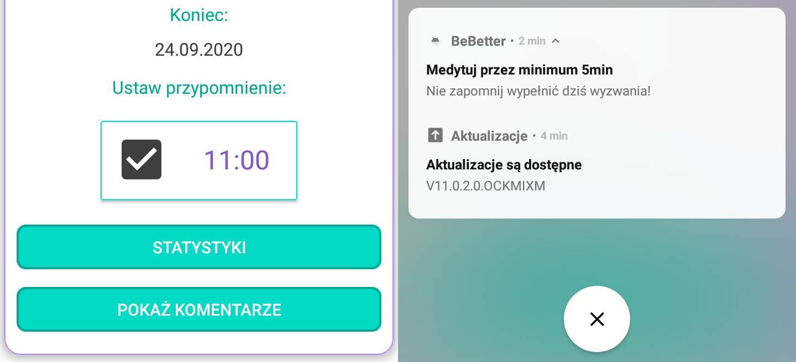

# BeBetter-client

BeBetter is a habit tracker application with reward system and elements of competition.

With BeBetter users can create challenges (habits) and track progress in completing that challenges. Many users can join one challenge and have a conversation in the comments. For completing goals users are rewarded with points and achievements, which are visible on users' profile pages. Users can follow each other and see friends in ranking list. 

BeBetter-client is an Android mobile application that consumes the REST API exposed by ([BeBetter-server](https://github.com/ozarychta/BeBetter-server)) and serves as a graphical user interface for the application.

Project is still under development - additional funcionalities will be added and refactoring will be done.

## Main functionalities

#### Signing in with Google account
 

#### Searching for challenges (habits) to join
  

#### Or creating new challenges
 

#### My challenges view showing challenges that user is taking part in

#### Tracking progress in challenges (and receiving points for it)
 

#### Setting reminders

#### Simple statistics
 

#### Commenting challenges

#### User profile
 

#### Friends list (also serving as a ranking)

## Technologies and tools
* Android
* Java
* Google Sign-In, JWT authorization
* Volley
* MPAndroidChart
* Room Persistence Library, SQLite
* Android Studio

## Functionalities to add in future
* Add more statistics (comparing user with other challenge participants, maybe ranking for each challenge)
* Showing list of challenges that user participates in on his profile page
* ToDoToday view showing in one place progress tracking sections from all challenges active on that day
* Setting custom message for reminder
* Setting profile picture
* Application dark theme
